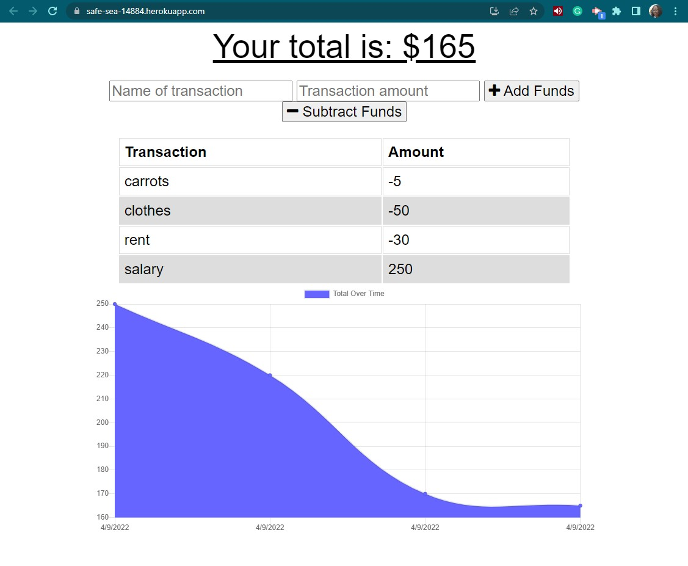
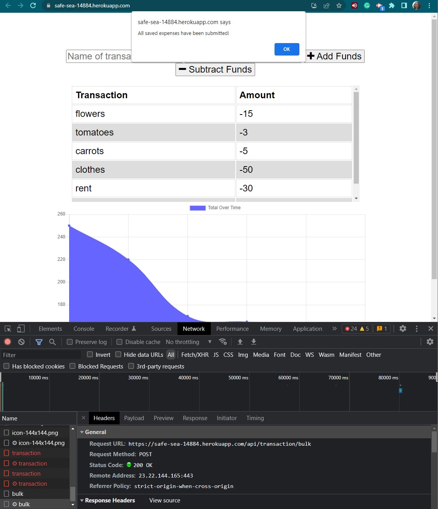

# Budget Tracker App

## Description

This application allows offline access and functionality of a budget tracker, allowing users to add expenses dn deposits to their budgert with or without a connection. 

You may view the deployed application by [clicking this link](https://safe-sea-14884.herokuapp.com/).

## Technologies

- The application uses IndebDB and a service worker for offline functionality.
- Express.js server to test the service worker.
- Web manifest let's users know what they are installing and how it should look on their screen.

## Criteria

**User Story**

AS AN avid traveler
I WANT to be able to track my withdrawals and deposits with or without a data/internet connection
SO THAT my account balance is accurate when I am traveling 

**Acceptance Criteria**

GIVEN a budget tracker without an internet connection

WHEN the user inputs an expense or deposit
THEN they will receive a notification that they have added an expense or deposit

WHEN the user reestablishes an internet connection
THEN the deposits or expenses added while they were offline are added to their transaction history and their totals are updated

## Accomplishments and Challenges

The application successfully connects to the database and functions online and offline, as expected. 

**Below are a screenshots of the app showing the functionality:**

Below are images from Insomnia, displaying data:  
 
  
 
  
 
## Contributing

## Credits

**The following resources were used to complete this project:**
1. UCONN Coding Bootcamp's modules on Progressive Web Apps
2. [Express](https://devdocs.io/express/) Documentation 
3. [Service Worker](https://developer.chrome.com/docs/workbox/service-worker-overview/) Documentation 
4. [MDN Web Docs on IndexDB](https://developer.mozilla.org/en-US/docs/Web/API/IndexedDB_API/Using_IndexedDB) Documentation 
5. This Medium article on [How to use IndexDB to build Progressive Web Apps](https://medium.com/jspoint/indexeddb-your-second-step-towards-progressive-web-apps-pwa-dcbcd6cc2076)

## License

